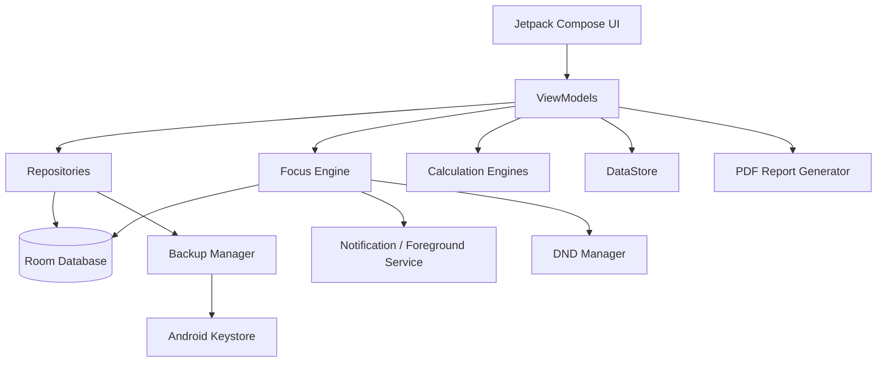

# Trackaa

> A privacy-first Android deep-work operating system for tracking **real focused work**, connecting time to meaningful goals, and continuously recalculating the path to your targets.

[](https://github.com/Ishara2004/Trackaa/actions/workflows/android-ci.yml)


Trackaa grew from a simple handwritten habit: record every real study interval, total the actual focused minutes, and compare that truth with the work still required. The app expands that method into a local-first performance system rather than a generic stopwatch.

## Product principle

**Track real focused work → connect it to goals → measure actual progress → forecast what remains → recover intelligently when the plan slips.**

Trackaa deliberately separates focus time from pause/break time. It does not treat the entire wall-clock interval between Start and Stop as productive work.

## Current status

Trackaa is under active development. The repository contains a substantial native Android implementation, but the project should be treated as **pre-release / advanced alpha** until the production-readiness PR is fully verified on CI and representative real Android devices.

Current priorities are correctness, recoverability and truthful analytics before public-store polish.

## Core model

```text
Goal
└── Module / Project / Work Area
    └── Topic
        └── Task
            └── Focus Session
                ├── Focus segments
                ├── Pause segments
                ├── Break segments
                └── Interruptions
```

A focus session can switch tasks without ending the logical session. Analytics are derived from verified focus segments, not blindly from session wall time.

## Implemented foundations

### Focus engine

- Stopwatch
- Countdown with overtime
- Pomodoro presets
- Pause / Resume
- Manual breaks
- Task switching during a session
- Interruption logging
- Session intent
- Mandatory Focus Quality rating (1–5)
- Mandatory Energy rating (1–5)
- Optional outcome/reflection
- Exact-second internal tracking
- Persistent crash/restart checkpoint
- Recovery-safe behavior that does not invent unknown downtime
- Persistent notification controls
- Android foreground-service integration

### Work structure

- Goals
- Module / Project / Work Item abstraction
- Topics
- Tasks
- Task priority/status
- Estimated vs actual focus time foundation
- Task dependencies in the data model
- Academic credits
- Target focus hours
- Soft deletion / Trash

### Targets and planning

- Daily / Weekly / Monthly / Deadline target model
- Minimum / Goal / Stretch tiers
- Global / Goal / Work-Item scope model
- Target revision history model
- Weekly availability and capacity
- Capacity-feasibility calculations
- Focus Debt / Focus Credit
- Capacity-aware Recovery Plan engine
- What-if completion calculations
- Rolling pace / projected completion engine

### Analytics

Current analytics foundations include:

- Day / Week / Month selection
- Verified focus total
- Daily average
- Longest session
- Pause ratio
- Focus Quality / Energy averages
- interruption count
- time-of-day distribution
- work-item distribution data
- Focus Debt / Credit
- Recovery Plan
- rolling forecast
- what-if simulations

Additional high-density historical views are tracked in the roadmap.

### Android focus protection

Trackaa can request Android notification-policy access and temporarily apply focus protection during a session. DND ownership state is persisted so cleanup is safer across process recreation. Permission denial must not prevent core time tracking.

### Local data and privacy

The V1 architecture is intentionally local-first:

- Room database
- DataStore preferences
- no required account
- no cloud sync
- no in-app generative AI
- no advertising SDK
- no required behavioral telemetry

The Gradle configuration intentionally excludes the Firebase AI/network template dependencies that were present in the original generated project.

### Backup and recovery

Trackaa contains two backup paths:

1. **Portable encrypted backup** — AES-GCM with a user passphrase derived using PBKDF2-HMAC-SHA256.
2. **Automatic private backup** — encrypted with an Android Keystore-managed AES key and rotated in private app storage.

Full-workspace snapshots include goals, work items, topics, tasks, session/segment history, interruptions, targets/revisions, availability, audit events, XP/achievements, scheduled focus and reporting-period data.

Restore validates the snapshot, creates a safety snapshot, and performs database replacement transactionally.

## Architecture



See [docs/ARCHITECTURE.md](docs/ARCHITECTURE.md) for deeper design notes.

## Technology

- Kotlin
- Jetpack Compose + Material 3
- Room
- DataStore
- Kotlin Coroutines / Flow
- WorkManager
- Android foreground services / notifications
- Android notification-policy APIs
- Android Keystore
- `PdfDocument`
- JUnit / Robolectric / Roborazzi
- GitHub Actions

### Android configuration

```text
minSdk:     26
targetSdk:  36
compileSdk: 36
Java:       17
```

## Build

### Android Studio

Open the repository in a current Android Studio version, allow Gradle sync to complete, and run the `app` configuration.

### Command line

The CI configuration uses an installed Gradle 9.6 distribution:

```bash
gradle testDebugUnitTest
gradle lintDebug
gradle assembleDebug
```

`gradlew` / `gradlew.bat` launch scripts are included. The binary `gradle-wrapper.jar` must also be present for wrapper-based invocation; if it is missing in a clone, regenerate the standard wrapper with Gradle 9.6 before relying on `./gradlew`.

## Verification

The Android CI workflow runs:

```text
Unit tests
→ Android lint
→ assembleDebug
→ debug APK artifact upload
```

A green badge is the repository-level evidence that the current branch compiles and passes automated verification. Device-specific behavior such as DND, exact alarms, background restrictions and OEM battery policies still requires real-device testing.

## Data integrity rules

Trackaa treats focus history as performance data, so several invariants are intentional:

- no interval may be counted twice
- pause and break intervals are never counted as verified focus
- sub-minute work is not inflated to one minute
- Stop freezes the logical session end time before the review form
- unknown process/device downtime is not silently credited as focus
- daily attribution splits verified intervals at local-midnight boundaries
- infeasible plans expose a capacity deficit instead of allocating impossible hours
- target progress may exceed 100%

See [docs/CALCULATIONS.md](docs/CALCULATIONS.md).

## Repository layout

```text
app/src/main/java/com/example/
├── data/
│   ├── backup/
│   ├── dao/
│   ├── database/
│   ├── entity/
│   ├── model/
│   └── repository/
├── domain/
│   ├── calculations/
│   ├── focus/
│   └── pdf/
├── services/
└── ui/
    ├── analytics/
    ├── components/
    ├── focus/
    ├── goals/
    ├── home/
    ├── more/
    ├── navigation/
    └── theme/
```

## Documentation

- [Architecture](docs/ARCHITECTURE.md)
- [Calculation rules](docs/CALCULATIONS.md)
- [Testing strategy](docs/TESTING.md)
- [Privacy principles](PRIVACY.md)
- [Roadmap](ROADMAP.md)
- [Security policy](SECURITY.md)
- [Contributing](CONTRIBUTING.md)

## Roadmap highlights

Before a stable public release, Trackaa still needs exhaustive real-device verification and additional product surfaces including richer target management, historical session editing/audit, expanded analytics (Semester/Year/All-Time, calendar heatmap, timeline and legacy AM/PM log), stronger onboarding/permissions UX, and broader automated coverage.

See [ROADMAP.md](ROADMAP.md) for the tracked sequence.

## Privacy

Trackaa is designed so personal productivity history can remain on the device. See [PRIVACY.md](PRIVACY.md).

## Security

Do not commit signing keys, passphrases or local configuration secrets. Please report security concerns according to [SECURITY.md](SECURITY.md).

## License

Released under the [MIT License](LICENSE).

---

**Trackaa** — measure the work that actually happened, then plan from reality.
