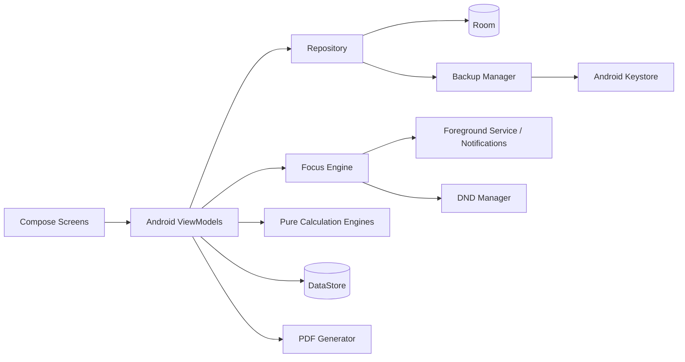

# Trackaa Architecture

## Design goals

Trackaa is optimized for five properties:

1. **truthful time accounting**
2. **offline-first ownership**
3. **recoverability**
4. **explainable planning calculations**
5. **Android reliability without unnecessary background work**

## Layers



### UI layer

Jetpack Compose screens are grouped by product surface:

- Home
- Focus
- Goals
- Analytics
- More/System tools

ViewModels coordinate data and Android-domain actions. Domain calculations should not live in composables.

### Persistence layer

Room is the authoritative durable workspace store.

Core hierarchy:

```text
Goal → Work Item → Topic → Task
```

Focus history is represented as a logical session plus interval-level records:

```text
FocusSession
├── FocusSegment[]
├── PauseSegment[]
├── BreakSegment[]
└── Interruption[]
```

Exact segment timestamps/seconds are the preferred source for analytics. Minute aggregates exist for compatibility/display and should be treated as derived values.

### Focus engine

The FocusEngine is a state machine:

```text
IDLE
  ↓ Start
FOCUSING ↔ PAUSED
  ↓ Break
ON_BREAK
  ↓ Pomodoro break finishes
BREAK_COMPLETE
  ↓ User resumes
FOCUSING
  ↓ Stop
REVIEW_PENDING
  ↓ Save/Discard
IDLE
```

Important invariants:

- only FOCUSING intervals become verified focus segments
- Stop freezes the session end timestamp
- review time is not session time
- recovered unknown downtime is not credited automatically
- the next Pomodoro focus interval never starts without user action

### Checkpointing and recovery

Active state is checkpointed locally. During normal running the checkpoint is refreshed periodically. If Trackaa recovers a session after a process/device interruption, it closes any open interval at the **last verified checkpoint** and moves the logical session to review. This intentionally favors under-counting an uncertain short tail over inventing unverified focus time.

### Foreground service

A user-started focus session is accompanied by a foreground service and persistent notification controls. The timer does not need a battery-intensive background second counter for correctness because authoritative elapsed time comes from timestamps; the periodic UI ticker is presentation/state refresh.

### DND ownership

DND is optional. Trackaa records whether it activated focus protection and the prior filter so it can attempt a safe restore. DND is not the authoritative session state: failure/denial of the permission must not stop focus tracking.

### Calculation engines

Pure calculation classes cover:

- duration/calendar splitting
- target tiers and Debt/Credit
- capacity allocation
- recovery planning
- forecasting
- what-if simulation
- weighted progress
- momentum
- streak / level calculations

This separation makes the highest-risk math independently testable.

### Backup architecture

Portable backup:

```text
Room snapshot → JSON → PBKDF2-HMAC-SHA256 → AES-GCM → portable payload
```

Automatic local backup:

```text
Room snapshot → JSON → Android Keystore AES-GCM → app-private rotating file
```

Restore validates the snapshot, creates a pre-restore safety snapshot, then replaces the workspace inside a Room transaction.

## Deliberate non-goals for V1

- mandatory accounts
- cloud synchronization
- Firebase data backend
- in-app generative AI
- advertising/marketing telemetry

These may only be introduced through an explicit product and privacy decision.

## Known architecture work before stable release

- database-level foreign-key enforcement/migrations
- historical-session edit/reallocation transaction
- systematic recalculation of duplicated minute aggregates after edits
- fully isolated demo workspace
- richer target/settings UI
- migration tests across every released schema
